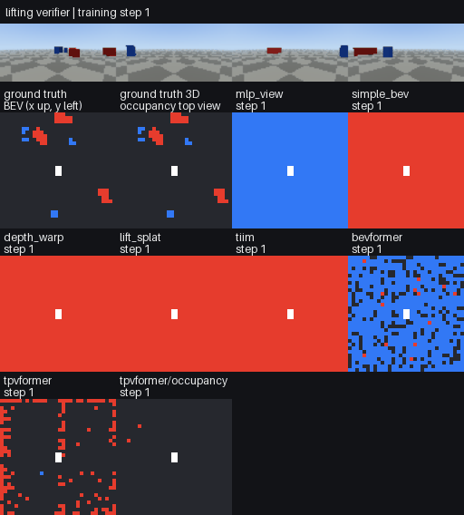

# Halos-lift (`lifting`)

**Pure-PyTorch 2D → BEV / 3D lifting for robotics and autonomous driving.**

TPVFormer, BEVFormer, Lift-Splat-Shoot, Simple-BEV, TIIM and friends, rewritten without
`mmcv`, `mmdet3d`, custom CUDA kernels or compiled ops. Every lifter shares one interface and is
verified to learn from camera geometry on procedurally rendered 3D scenes.



*The verifier trains every lifter on synthetic multi-camera scenes where the camera rig is
randomly rotated in each scene. Top: the 4 camera views. Tiles: ground truth, the geometry-free
baseline, and each lifter's BEV prediction as training progresses. The final frame rotates the
extrinsics while keeping the images fixed; every geometric lifter must then fail.*

---

## Install

```bash
# with uv (recommended)
uv add "halos-lift @ git+https://github.com/basaanithanaveenkumar/Halos-lift"
# or pip
pip install "git+https://github.com/basaanithanaveenkumar/Halos-lift"
# optional torchvision ResNet backbones
uv add "halos-lift[vision] @ git+https://github.com/basaanithanaveenkumar/Halos-lift"
```

The distribution is called `halos-lift` and the import name is `lifting`:
`from lifting import build_bev_model`.

The only dependencies are `torch`, `numpy` and `pillow`. The library runs on CPU, CUDA and MPS.

## 30-second tour

```python
import torch
from lifting import GridSpec, Cameras, build_bev_model, build_tpvformer

grid = GridSpec(x_bounds=(-16, 16), y_bounds=(-16, 16), z_bounds=(-1, 3), resolution=(32, 32, 4))
cameras = Cameras(
    intrinsics=K,            # (B, N, 3, 3) pixel-from-camera
    cam_to_ego=T,            # (B, N, 4, 4) camera (OpenCV) -> ego (x fwd, y left, z up)
    image_size=(H, W),
)

# BEV semantic segmentation with ANY lifter
model = build_bev_model("bevformer", grid, num_classes=3, image_size=(H, W), num_cameras=N)
logits = model(images, cameras)["logits"]            # (B, 3, X, Y)

# TPVFormer 3D semantic occupancy + point queries
tpv = build_tpvformer(grid, num_classes=3)
out = tpv(images, cameras, points=lidar_xyz)         # voxel_logits (B,3,X,Y,Z), point_logits (B,3,P)
```

Use a lifter on its own with your own encoder:

```python
from lifting import LIFTERS
lifter = LIFTERS.build("lift_splat", grid=grid, in_channels=128, out_channels=128)
bev = lifter(features, cameras)   # features: list of (B, N, C, H_l, W_l), fine -> coarse
```

## Lifters

| name | class | paper / origin | how it lifts |
|---|---|---|---|
| `simple_bev` | `BilinearSamplingLifter` | Simple-BEV, `simple_bev/nets/segnet.py` | project voxel centres, bilinear-sample, compress height |
| `depth_warp` | `DepthWarpLifter` | `simple_bev/nets/liftnet.py` | depth-weighted frustum volume, *pulled* per voxel (trilinear) |
| `lift_splat` | `LiftSplatLifter` | Lift-Splat-Shoot, `simple_bev/nets/liftnet2.py` | depth distribution × context, *splatted* by voxel pooling |
| `bevformer` | `BEVFormerLifter` | BEVFormer, `simple_bev/nets/bevformernet{,2}.py` | BEV queries + deformable self-attn + spatial cross-attn over pillar anchors (single- or multi-scale) |
| `tiim` | `PolarRayLifter` | Translating Images into Maps, `simple_bev/nets/tiimnet.py` | column transformer → polar rays → resampled onto the Cartesian grid |
| `tpvformer` | `TPVFormerLifter` | TPVFormer (wzzheng/TPVFormer) | three orthogonal planes, cross-view hybrid attention + per-plane image cross-attention |
| `mlp_view` | `MLPViewLifter` | VPN-style | geometry-free view MLP, used as the **negative control** |

### Pure-PyTorch ops and attention (2D and 3D)

| component | replaces |
|---|---|
| `ops.multi_scale_deformable_attn_2d` | `MultiScaleDeformableAttnFunction` CUDA kernel |
| `ops.multi_scale_deformable_attn_3d` | volumetric (trilinear) version for voxel pyramids |
| `ops.voxel_pooling` | LSS `QuickCumsum` / Simple-BEV `VoxelsSumming` |
| `attention.MSDeformableAttention2D` | Deformable-DETR / BEVFormer temporal & self attention |
| `attention.MSDeformableAttention3D` | multi-scale deformable attention over 3D volumes |
| `attention.PillarDeformableAttention` | BEVFormer/TPVFormer `MSDeformableAttention3D` (multi-anchor, into images) |
| `attention.SpatialCrossAttention` | BEVFormer / TPVFormer image cross-attention |
| `attention.CrossViewHybridAttention` | TPVFormer cross-view hybrid attention |

The ops are checked against explicit loop implementations and with `torch.autograd.gradcheck`.

## Verification: does each lifter really lift?

```bash
lifting-verify --gif verification.gif --json report.json     # ~5 min on a laptop CPU
```

The verifier renders multi-camera scenes with an exact ray caster (`lifting.data`): a checkerboard
ground, sky, and yaw-rotated vehicle and pedestrian boxes. It also produces exact BEV and 3D
occupancy labels. Every lifter is trained end to end on BEV semantic segmentation, and TPVFormer
is also trained on **3D semantic occupancy**. A lifter passes only if all of these hold:

1. **beats_baseline**: its mIoU beats the geometry-free `mlp_view` control by ≥ 0.15. The whole
   camera rig is randomly rotated in every scene, so no model can succeed without the calibration.
2. **uses_geometry**: when the extrinsics are rotated by 90° (images and labels unchanged), its
   mIoU drops by ≥ 50%.
3. **loss_decreases**: its smoothed training loss falls by ≥ 30%.

The GIF is written only when the verification passes. Latest CPU run (300 steps, 32×32×4 grid,
4 cameras at 48×96):

| lifter | task | mIoU ↑ | mIoU with rotated extrinsics ↓ | loss start → end | CPU time | checks |
|---|---|---|---|---|---|---|
| `mlp_view` (control) | BEV | 0.000 | 0.000 | 1.046 → 0.555 | 13 s | baseline |
| `simple_bev` | BEV | 0.510 | 0.016 | 0.990 → 0.133 | 12 s | ✅ ✅ ✅ |
| `depth_warp` | BEV | 0.493 | 0.016 | 0.866 → 0.129 | 16 s | ✅ ✅ ✅ |
| `lift_splat` | BEV | 0.456 | 0.015 | 0.866 → 0.147 | 16 s | ✅ ✅ ✅ |
| `tiim` | BEV | 0.404 | 0.017 | 1.042 → 0.178 | 16 s | ✅ ✅ ✅ |
| `bevformer` | BEV | 0.528 | 0.016 | 0.916 → 0.122 | 28 s | ✅ ✅ ✅ |
| `tpvformer` | BEV | 0.522 | 0.016 | 0.821 → 0.121 | 39 s | ✅ ✅ ✅ |
| `tpvformer` | 3D occupancy | 0.418 | 0.016 | 0.589 → 0.087 | 40 s | ✅ ✅ ✅ |

mIoU is the mean over the foreground classes (vehicle, pedestrian). The full JSON is in
[`assets/verification_report.json`](assets/verification_report.json).

## Tests

```bash
uv run pytest -m "not slow"     # unit + lifting + integration + training + verifier tests
uv run pytest -m slow           # the full verification as a test
```

| suite | what it proves |
|---|---|
| `tests/unit` | cameras, grid, ops vs naive loops, gradcheck, attention modules, registry, encoders, metric |
| `tests/lifting` | **analytic lifting probes**: with pixel/depth *ramp* features each lifter must return, for every voxel, the exact pixel/depth where it is seen; Lift-Splat puts mass in the right voxel; 90° rig rotation ⇒ 90° rotated volume (equivariance); BEVFormer/TPV reference points are projected pillars/lines; TPV plane ↔ voxel ↔ point consistency |
| `tests/data` | the renderer is geometrically exact (ground pixels unproject to z=0, box pixels onto the box), labels match objects |
| `tests/integration` | every lifter end-to-end with gradients reaching the encoder, 6-camera rigs, ResNet + multi-scale BEVFormer, TPVFormer occupancy & points, state-dict round trip, examples |
| `tests/training` | every lifter overfits a batch; TPVFormer occupancy training |
| `tests/verification` | judging logic, extrinsic corruption, report/JSON/GIF, CLI, full verification (`slow`) |

## Design

```
src/lifting/
├── geometry/      Cameras, GridSpec, DepthBins      (conventions in one place)
├── ops/           pure-PyTorch deformable attention 2D/3D, voxel pooling, camera sampling
├── attention/     deformable attention modules      (one class per file)
├── layers/        ConvNormAct, ResidualBlock, FeedForward, HeightCompressor
├── encoders/      ImageEncoder ABC, SimpleConvEncoder, ResNetEncoder, FPN
├── lifters/       BaseLifter ABC + LIFTERS registry + all lifters (bevformer/, tpvformer/ sub-packages)
├── decoders/      BEVDecoder, SegmentationHead
├── models/        BEVSegmentationModel, TPVFormer, factories
├── data/          synthetic world: CameraRig, ObjectSampler, RayCastRenderer, LabelRasterizer, dataset
├── training/      Trainer + Task strategies (BEV segmentation, occupancy)
├── metrics/       IoUMetric
└── verification/  LiftingVerifier, ExtrinsicCorruption, reports, GIF renderer
```

How the code maps to the SOLID principles:

* **Single responsibility**: one class per file. Geometry, sampling, attention, lifting, decoding,
  training and verification are separate packages.
* **Open/closed**: new lifters register with `@LIFTERS.register("name")`; see
  `examples/custom_lifter.py`. Nothing in the library needs editing.
* **Liskov**: every lifter satisfies `BaseLifter.forward(features, cameras) -> (B, C, X, Y)` and
  can be swapped into `BEVSegmentationModel` and the verifier.
* **Interface segregation**: lifters see only feature maps and `Cameras`; the trainer sees only a
  `Task`.
* **Dependency inversion**: models receive their encoder, lifter, decoder and head; the dataset
  receives its rig, sampler and renderer; the trainer receives its task.

### Conventions

* Ego frame: x forward, y left, z up. Camera frame: OpenCV (x right, y down, z forward).
* Pixel `i` covers `[i, i+1)`, which is the same convention as `grid_sample(align_corners=False)`.
  Rescaling intrinsics to any feature level is therefore exact.
* BEV `(B, C, X, Y)`, voxels `(B, C, X, Y, Z)`, TPV planes `xy (X, Y)`, `xz (X, Z)`, `yz (Y, Z)`.

## Credits

Re-implementations based on [TPVFormer](https://github.com/wzzheng/TPVFormer),
[Simple-BEV](https://github.com/aharley/simple_bev), [BEVFormer](https://github.com/fundamentalvision/BEVFormer),
[Lift-Splat-Shoot](https://github.com/nv-tlabs/lift-splat-shoot) and
[Translating Images into Maps](https://github.com/avishkarsaha/translating-images-into-maps).
MIT licensed.
