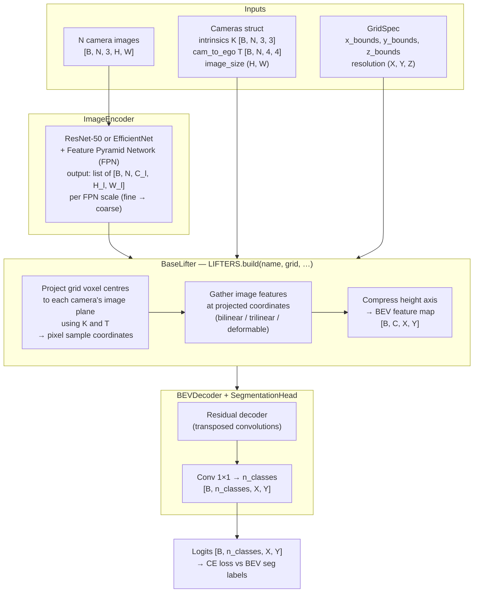
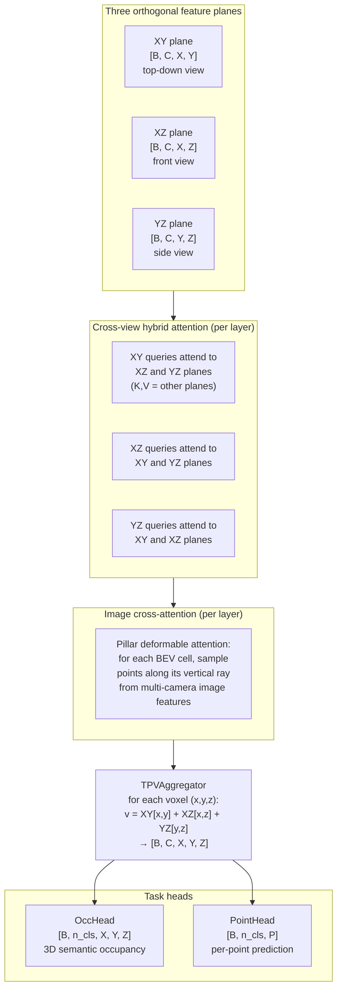
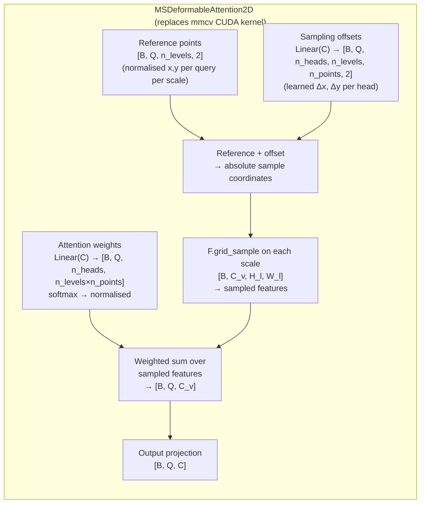
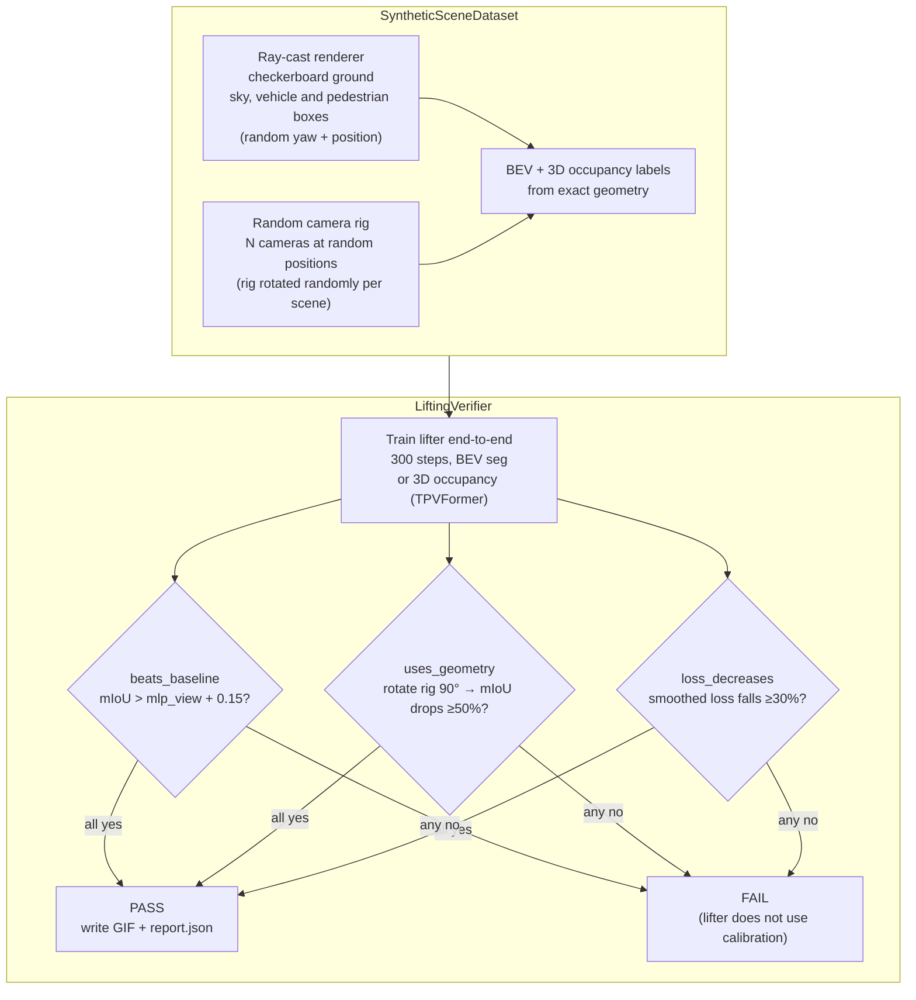
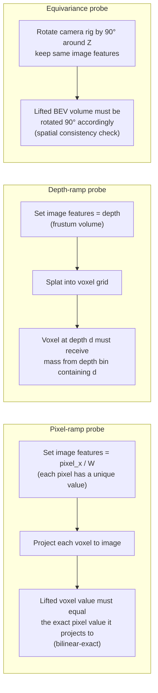
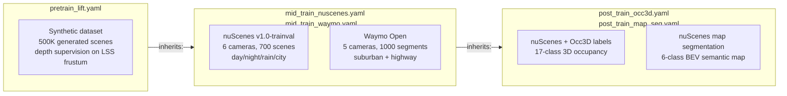

# Architecture

Mermaid diagrams (render on GitHub). See also the [project page](../project-page/index.html)
and the [README](../README.md) for a laymen overview.

---

## 1. Full pipeline — any lifter, one interface

---

## 2. Lifter internals — six strategies compared

```mermaid
flowchart TB
  subgraph SIMPLE_BEV["simple_bev — BilinearSamplingLifter"]
    SB1["For each voxel centre (x,y,z):\nproject to image plane via K·T⁻¹"]
    SB2["Bilinear-sample feature at\nnormalised pixel coordinates\nusing F.grid_sample"]
    SB3["Voxel tensor [B, C, X, Y, Z]\nmean/max pool over Z\n→ BEV [B, C, X, Y]"]
    SB1 --> SB2 --> SB3
  end

  subgraph LIFT_SPLAT["lift_splat — LiftSplatLifter"]
    LS1["Predict depth distribution\nD bins per pixel column\np(d | pixel) via softmax"]
    LS2["Outer product: context × depth\n→ frustum feature volume\n[B, N, C, D, H_feat, W_feat]"]
    LS3["Splat into voxel grid\n(QuickCumsum voxel pooling)\n→ [B, C, X, Y, Z] → BEV"]
    LS1 --> LS2 --> LS3
  end

  subgraph BEVFORMER["bevformer — BEVFormerLifter"]
    BF1["Learnable BEV queries\n[X·Y, C] — one per grid cell"]
    BF2["Deformable self-attention\nBEV queries attend to each other\n(reference points = pillar centres)"]
    BF3["Spatial cross-attention\nBEV queries attend to image features\nthrough deformable attention\n(multi-camera, multi-scale)"]
    BF4["FFN → refined BEV queries\nreshape [B, C, X, Y]"]
    BF1 --> BF2 --> BF3 --> BF4
  end

  subgraph TIIM["tiim — PolarRayLifter"]
    TI1["Column transformer\nattend along each image column"]
    TI2["Project to polar ray\nfor each camera ray direction"]
    TI3["Resample from polar\nonto Cartesian BEV grid\nvia F.grid_sample"]
    TI1 --> TI2 --> TI3
  end
```

---

## 3. TPVFormer — tri-plane 3D representation

---

## 4. Pure-PyTorch deformable attention

---

## 5. Geometric verifier

---

## 6. Analytic lifting probes (test suite)

---

## 7. Training stage configs

